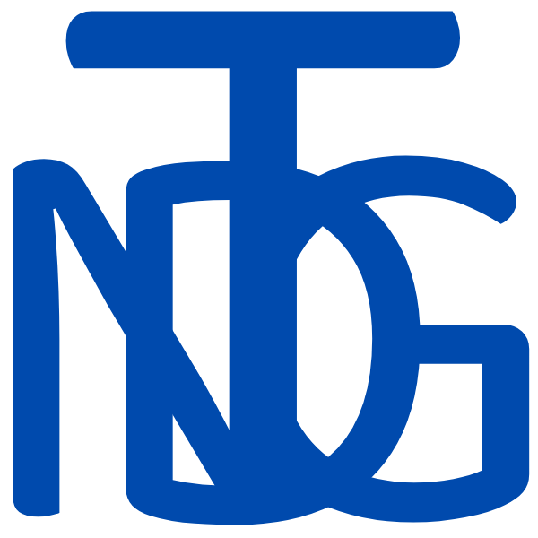

##  [)](https://git.io/typing-svg)

<br>

- :octocat: : Technical Project & Operation Manager, Product Owner, Technical Writer & Old-school Full-Stack Developer. I'm also an Academic Head of School of Computer Studies & Assistant Professor, but `on-hiatus`. 

- 🧪 : Currently exploring AI Text to Image Prompts, learning more about Generative AI, Crypto & NFTs, catching up with front-end & back-end technologies ATM (& some [Code Challenges](https://github.com/thenocturnaldevgypsy-io/code_challenges)). Loving GitHub [Projects](https://github.com/thenocturnaldevgypsy-io?tab=projects) ATM too.

<!-- - 🚀 : Open Source Projects Authored and Maintained: 
   - https://github.com/thenocturnaldevgypsy-io/nightfall-bootstrap-template-personal
   - https://github.com/thenocturnaldevgypsy-io/gypsyshards-bootstrap-template-linkinbio 

- 💡 : Planning to start the following open source projects by 2025: Static Page Generator, Font Library for Crypto, Link in Bio CMS. -->

- 💬 : Feel free to contact me by [creating a new discussion](https://github.com/thenocturnaldevgypsy-io/thenocturnaldevgypsy-io/discussions/new?category=ask-me-anything-ama-and-q-a) at **💬 Ask Me Anything! (AMA and Q&A)** category under my GitHub Profile Repo's Discussions.

<!-- <details open> 
  <summary><h2>📘 My Top Open Source Projects</h2></summary>
</details> -->

## 
↦ 🎨 : I do traditional Pen and Ink + Watercolour Illustrations too! 

[](https://www.yaindigo.art)
[](https://beacons.ai/yaindigo.art)

## 

↦ 🔥 : GitHub Support is done unflagging my original account [@thenocturnaldevgypsy](https://github.com/thenocturnaldevgypsy) last January 14, 2025 (it got flagged for no reason last October 18, 2024), now waiting for GitHub Support to answer my queries in my new support ticket [#3184741](https://support.github.com/ticket/personal/0/3184741) in how I can merge both accounts without losing my activities/updates in this account. :smiling_face_with_tear:

<!-- ↦ 🔥 : My 10 years 11 days old `@thenocturnaldevgypsy` GitHub account since October 8, 2014 got flagged for no reason as of October 18, 2024. I ended up recreating all my public & private repos at `@thenocturnaldevgypsy-io` to continue working, and still waiting for GitHub Support to check my ticket [#3055761](https://support.github.com/ticket/personal/0/3055761) since then :smiling_face_with_tear: -->

## 

[](https://www.thenocturnaldevgypsy.io)
[](https://www.linkedin.com/in/abegail-torrendon/)
[](https://beacons.ai/thenocturnaldevgypsy)
[](https://github.com/thenocturnaldevgypsy-io)
[](https://www.instagram.com/nocturnal.indigo/)
[](https://mastodon.social/@TheNocturnalDevGypsy)
[](https://x.com/nocturnalgypsy_)
[](mailto:i.am.abby@thenocturnaldevgypsy.io)

## 
Aside🌟, 👁️, 🔱 & ❤️ some of the repos - hire me, buy some of my NFTs or (maybe) just simply buy me a ☕ at **Ko-Fi**? :smiling_face_with_tear:

[](https://www.upwork.com/freelancers/~0135fa830786a3f536?s=1484275220996608000)
[-/user/4296077072-24292e?logo=file-binary&logoColor=white&labelColor=00416a)](https://uncut.network/user/4296077072)
[](https://ko-fi.com/thenocturnaldevgypsy)

## 

| Domain Knowledge |       |
|------------------|---|
| Programming, Framework, Tools |                       |
| Graphics, Design, AI |     |
| PM, Writing, AI |         |

<!-- ## 

<a href="https://github.com/thenocturnaldevgypsy-io/nightfall-bootstrap-template-personal"></a> -->

## 


<!--START_SECTION:waka-->
**I'm a Night 🦉** 

```text
🌞 Morning                160 commits         ⬛⬛⬛⬛⬜⬜⬜⬜⬜⬜⬜⬜⬜⬜⬜⬜⬜⬜⬜⬜⬜⬜⬜⬜⬜   14.32 % 
🌆 Daytime                327 commits         ⬛⬛⬛⬛⬛⬛⬛⬜⬜⬜⬜⬜⬜⬜⬜⬜⬜⬜⬜⬜⬜⬜⬜⬜⬜   29.27 % 
🌃 Evening                380 commits         ⬛⬛⬛⬛⬛⬛⬛⬛⬛⬜⬜⬜⬜⬜⬜⬜⬜⬜⬜⬜⬜⬜⬜⬜⬜   34.02 % 
🌙 Night                  250 commits         ⬛⬛⬛⬛⬛⬛⬜⬜⬜⬜⬜⬜⬜⬜⬜⬜⬜⬜⬜⬜⬜⬜⬜⬜⬜   22.38 % 
```


📊 **This Week I Spent My Time On** 

```text
💻 Operating System: 
Windows                  31 hrs 39 mins      ⬛⬛⬛⬛⬛⬛⬛⬛⬛⬛⬛⬛⬛⬛⬛⬜⬜⬜⬜⬜⬜⬜⬜⬜⬜   61.03 % 
Mac                      20 hrs 13 mins      ⬛⬛⬛⬛⬛⬛⬛⬛⬛⬛⬜⬜⬜⬜⬜⬜⬜⬜⬜⬜⬜⬜⬜⬜⬜   38.97 % 
```


 Last Updated on 16/02/2025 07:15:03 UTC
<!--END_SECTION:waka-->

<!---
- 👋 Hi, I’m @thenocturnaldevgypsy-io
- 👀 I’m interested in ...
- 🌱 I’m currently learning ...
- 💞️ I’m looking to collaborate on ...
- 📫 How to reach me ...
- 😄 Pronouns: ...
- ⚡ Fun fact: ...

thenocturnaldevgypsy-io/thenocturnaldevgypsy-io is a ✨ special ✨ repository because its `README.md` (this file) appears on your GitHub profile.
You can click the Preview link to take a look at your changes.
--->